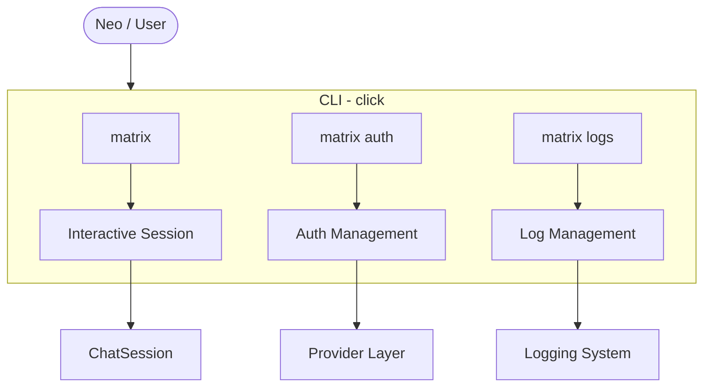

# CLI & Entry Points

## Purpose

The CLI is Neo's interface to the Matrix. It's how the user enters the system and initiates all interactions - chatting with the Operator, consulting the Oracle, working with the Architect, or deploying Seraph.

## Decisions

### Command Name

**Decided:** `matrix`

```bash
matrix          # Enter interactive mode (equivalent to cdd-agent chat)
matrix auth     # Authentication management
matrix logs     # Log management
```

### Subcommand Structure

| Command | Purpose | Equivalent in CDD |
|---------|---------|-------------------|
| `matrix` | Enter interactive mode, talk to Operator | `cdd-agent chat` |
| `matrix auth` | Manage credentials and providers | `cdd-agent auth` |
| `matrix logs` | View and manage logs | `cdd-agent logs` |

### Auth Subcommands

```bash
matrix auth setup       # Interactive configuration wizard
matrix auth oauth       # OAuth 2.0 flow (browser-based)
matrix auth status      # Show current auth configuration
matrix auth test        # Test connection to provider
matrix auth set-default # Set default provider
```

### Logs Subcommands

```bash
matrix logs show        # View recent logs
matrix logs clear       # Clear log files
matrix logs path        # Show log file location
matrix logs stats       # Show log statistics
```

## Open Questions (Team Discussion Required)

### Interactive Mode Flags

Potential flags to discuss with collaborators:

- `--provider` / `-p` - Choose LLM provider
- `--model` / `-m` - Choose model tier (small/mid/big)
- `--approval` / `-a` - Approval mode (paranoid/balanced/trusting)
- `--no-context` - Skip loading context files
- `--read-only` - No write tools (plan mode)

**Goal:** Improve UX - current flag-based approach may have better alternatives.

### Matrix Theme in CLI

Items to discuss:

- Startup messages (e.g., "Jacking in...", "Welcome to the Matrix, Neo")
- Prompt style (`neo>`, `matrix>`, or minimal)
- Color scheme (green-on-black Matrix aesthetic?)
- ASCII art on startup?
- Level of thematic immersion vs. professional tooling

## Dependencies

- **click** - CLI framework (same as CDD)
- Configuration System (for reading settings)
- Provider Layer (for `auth test`)
- Logging System (for `logs` commands)

## Diagram


