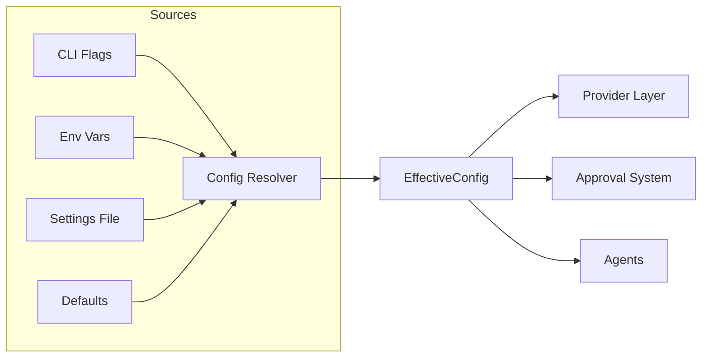

# Configuration System

## Purpose

Manages all persistent settings - credentials, provider preferences, default behaviors. This allows users to set up once and use the tool seamlessly across sessions.

## Decisions

### Config Location

**Decided:** `~/.matrix/`

```
~/.matrix/
├── settings.json    # Main configuration file
└── oauth/           # OAuth tokens (if applicable)
```

### Environment Variable Prefix

**Decided:** `MATRIX_*`

| Variable | Purpose |
|----------|---------|
| `MATRIX_AUTH_TOKEN` | Override auth token |
| `MATRIX_BASE_URL` | Override API base URL |
| `MATRIX_APPROVAL_MODE` | Override approval mode |
| `MATRIX_EXECUTION_MODE` | Override execution mode |
| `MATRIX_PROVIDER` | Override default provider |

Provider-specific overrides also supported:
- `ANTHROPIC_API_KEY`
- `OPENAI_API_KEY`

### Model Tiers

**Decided:** `small/mid/big`

Simple, clear, provider-agnostic. Maps to specific models per provider:

| Tier | Anthropic | OpenAI |
|------|-----------|--------|
| small | claude-3-5-haiku | gpt-4o-mini |
| mid | claude-sonnet-4 | gpt-4o |
| big | claude-opus-4 | gpt-4-turbo |

### Config Structure

**Decided:** Keep same structure as CDD

```json
{
  "version": "1.0",
  "default_provider": "anthropic",
  "approval_mode": "balanced",
  "default_execution_mode": "normal",
  "providers": {
    "anthropic": {
      "auth_token": "sk-ant-...",
      "base_url": "https://api.anthropic.com",
      "models": {
        "small": "claude-3-5-haiku-20241022",
        "mid": "claude-sonnet-4-5-20250929",
        "big": "claude-opus-4-20250514"
      },
      "default_model": "mid"
    },
    "openai": {
      "api_key": "sk-...",
      "base_url": "https://api.openai.com/v1",
      "models": {
        "small": "gpt-4o-mini",
        "mid": "gpt-4o",
        "big": "gpt-4-turbo"
      },
      "default_model": "mid"
    }
  }
}
```

## Priority Order

Configuration values are resolved in this order (highest priority first):

1. **CLI flags** - `matrix --provider openai`
2. **Environment variables** - `MATRIX_PROVIDER=openai`
3. **Settings file** - `~/.matrix/settings.json`
4. **Built-in defaults** - Hardcoded fallbacks

## Settings Fields

| Field | Type | Default | Description |
|-------|------|---------|-------------|
| `version` | string | "1.0" | Config schema version |
| `default_provider` | string | "anthropic" | Which provider to use |
| `approval_mode` | string | "balanced" | Tool approval behavior |
| `default_execution_mode` | string | "normal" | Execution mode for Seraph |
| `providers` | object | {} | Provider-specific configs |

### Approval Modes

| Mode | Behavior |
|------|----------|
| `paranoid` | Ask before every tool execution |
| `balanced` | Auto-approve safe tools, ask for writes |
| `trusting` | Remember approvals in session |

### Execution Modes

| Mode | Behavior |
|------|----------|
| `normal` | Interactive, waits for user input |
| `yolo` | Auto-continue on success (Seraph only) |

## Dependencies

- **pydantic** - Settings validation
- **python-dotenv** - Environment variable loading
- File system access for `~/.matrix/`

## Interface

```python
class ConfigManager:
    def load() -> Settings
    def save(settings: Settings) -> None
    def get_provider_config(provider: str) -> ProviderConfig
    def get_effective_config() -> EffectiveConfig  # Merged from all sources

class Settings(BaseModel):
    version: str
    default_provider: str
    approval_mode: str
    default_execution_mode: str
    providers: dict[str, ProviderConfig]

class ProviderConfig(BaseModel):
    auth_token: str | None
    api_key: str | None
    base_url: str
    models: dict[str, str]
    default_model: str
    oauth: OAuthTokens | None
```

## Diagram


