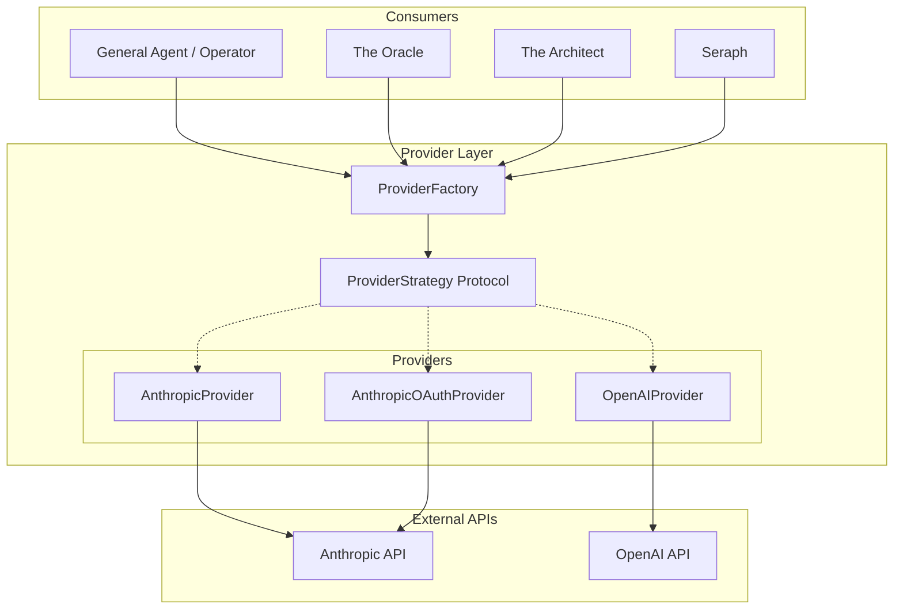

# Provider Layer

## Purpose

The Provider Layer abstracts LLM interactions, allowing Matrix CLI to work with different AI providers through a unified interface. This is the "phone line" that connects Neo to the Matrix - the communication channel to the AI systems that power all agents.

## Decisions

### Supported Providers

**Decided:** Anthropic + OpenAI

| Provider | Auth Methods | Status |
|----------|--------------|--------|
| Anthropic | API Key, OAuth | Supported |
| OpenAI | API Key | Supported |

### OAuth Support

**Decided:** Keep OAuth support (same as CDD)

OAuth provides:
- Browser-based authentication flow
- Automatic token refresh
- No need to manage API keys manually

### Streaming

**Decided:** Always stream

- Better UX - users see responses as they're generated
- No non-streaming mode needed
- Simplifies the interface

## Architecture

### Strategy Pattern

All providers implement a common protocol:

```python
class ProviderStrategy(Protocol):
    """Common interface for all LLM providers."""

    @property
    def client(self) -> Any:
        """The underlying API client."""
        ...

    def stream_message(
        self,
        messages: list[Message],
        system: str,
        tools: list[ToolSchema] | None = None,
        max_tokens: int = 4096,
    ) -> Iterator[StreamEvent]:
        """Stream a response from the LLM."""
        ...
```

### Provider Implementations

```python
class AnthropicProvider(ProviderStrategy):
    """Anthropic API with API key authentication."""
    pass

class AnthropicOAuthProvider(ProviderStrategy):
    """Anthropic API with OAuth authentication."""
    # Handles token refresh automatically
    pass

class OpenAIProvider(ProviderStrategy):
    """OpenAI API with API key authentication."""
    pass
```

### Factory Pattern

```python
def create_provider(config: ProviderConfig, model_tier: str = "mid") -> ProviderStrategy:
    """Create the appropriate provider based on configuration."""
    pass
```

## Stream Events

The provider yields these event types during streaming:

| Event Type | Description | Payload |
|------------|-------------|---------|
| `text_delta` | New text chunk | `{"text": "..."}` |
| `tool_use_start` | Tool call initiated | `{"id": "...", "name": "..."}` |
| `tool_use_delta` | Tool input chunk | `{"input_delta": "..."}` |
| `tool_use_end` | Tool call complete | `{"id": "..."}` |
| `message_end` | Response complete | `{"stop_reason": "..."}` |
| `error` | Error occurred | `{"message": "..."}` |

## Error Handling

| Error | Handling |
|-------|----------|
| Rate limit | Exponential backoff retry |
| Timeout | Retry with configurable timeout |
| Auth failure | Clear error message, prompt re-auth |
| Network error | Retry with backoff |

## Dependencies

- **anthropic** - Anthropic API client
- **openai** - OpenAI API client
- **httpx** - Async HTTP client
- **authlib** - OAuth 2.0 implementation
- Configuration System (for credentials)

## Diagram



## Usage Example

```python
# 1. Get configuration
config = ConfigManager().get_effective_config()

# 2. Create provider
provider = create_provider(config.providers["anthropic"], model_tier="mid")

# 3. Stream response
for event in provider.stream_message(
    messages=conversation.messages,
    system=system_prompt,
    tools=tool_schemas,
):
    if event["type"] == "text_delta":
        print(event["text"], end="", flush=True)
    elif event["type"] == "tool_use_start":
        handle_tool_start(event)
    elif event["type"] == "message_end":
        break
```
