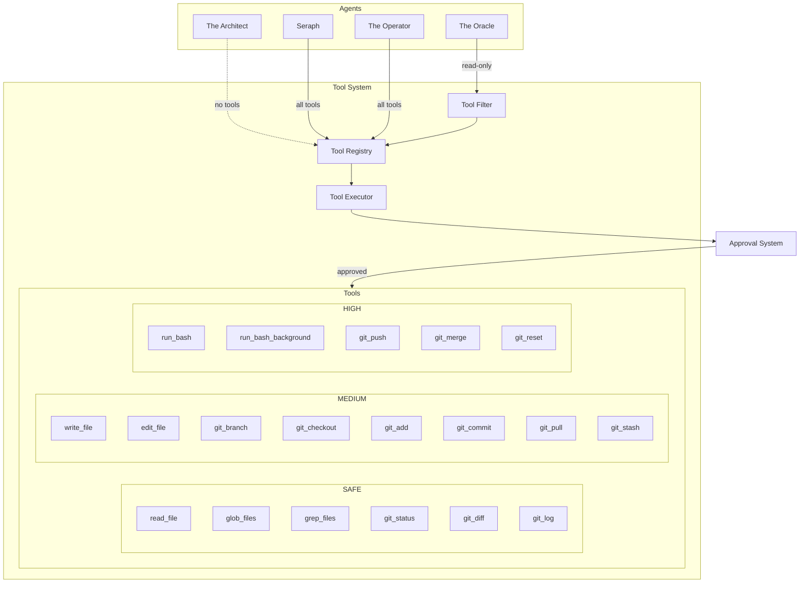

# Tool System

## Purpose

Tools are the abilities that agents have to interact with the real world - reading files, writing code, running commands. These are the "programs" agents can load into the Matrix to manipulate it.

## Decisions

### Tool Set

**Decided:** Same as CDD + expanded Git suite

#### File Operations

| Tool | Description | Risk Level |
|------|-------------|------------|
| `read_file` | Read file contents | SAFE |
| `write_file` | Write/create file | MEDIUM |
| `edit_file` | Edit existing file | MEDIUM |
| `glob_files` | Find files by pattern | SAFE |
| `grep_files` | Search file contents | SAFE |

#### Command Execution

| Tool | Description | Risk Level |
|------|-------------|------------|
| `run_bash` | Execute shell command | HIGH |
| `run_bash_background` | Execute in background | HIGH |
| `get_background_status` | Check background process | SAFE |
| `get_background_output` | Get process output | SAFE |
| `interrupt_background_process` | Kill background process | HIGH |

#### Git Operations (Expanded)

| Tool | Description | Risk Level |
|------|-------------|------------|
| `git_status` | Show working tree status | SAFE |
| `git_diff` | Show changes | SAFE |
| `git_log` | Show commit history | SAFE |
| `git_branch` | List/create branches | MEDIUM |
| `git_checkout` | Switch branches | MEDIUM |
| `git_add` | Stage files | MEDIUM |
| `git_commit` | Create commit | MEDIUM |
| `git_push` | Push to remote | HIGH |
| `git_pull` | Pull from remote | MEDIUM |
| `git_merge` | Merge branches | HIGH |
| `git_stash` | Stash changes | MEDIUM |
| `git_reset` | Reset changes | HIGH |

### Schema Generation

**Decided:** Auto-generate from Python function signatures (same as CDD)

```python
def read_file(path: str, encoding: str = "utf-8") -> str:
    """Read the contents of a file.

    Args:
        path: The file path to read
        encoding: File encoding (default: utf-8)

    Returns:
        The file contents as a string
    """
    ...

# Auto-generates:
{
    "name": "read_file",
    "description": "Read the contents of a file.",
    "input_schema": {
        "type": "object",
        "properties": {
            "path": {"type": "string", "description": "The file path to read"},
            "encoding": {"type": "string", "description": "File encoding (default: utf-8)"}
        },
        "required": ["path"]
    }
}
```

### Tool Filtering per Agent

**Decided:** Same approach as CDD

| Agent | Tools Available | Rationale |
|-------|-----------------|-----------|
| The Oracle | Read-only (SAFE) | Only needs to explore codebase |
| The Architect | None | Pure LLM planning, no execution |
| Seraph | All tools | Needs full access to implement |
| The Operator | All tools | General-purpose assistant |

### Background Process Management

**Decided:** Keep this feature

Use cases:
- Running tests in background
- Build processes
- Watch/dev servers
- Long-running commands

## Risk Levels

| Level | Description | Approval Behavior |
|-------|-------------|-------------------|
| SAFE | Read-only, no side effects | Auto-approved in balanced mode |
| MEDIUM | File modifications | Ask in balanced mode |
| HIGH | System commands, git push | Always ask (except trusting mode) |

## Architecture

### Tool Registry

```python
class ToolRegistry:
    """Central registry for all available tools."""

    def register(self, func: Callable, risk_level: RiskLevel) -> None:
        """Register a tool function."""
        ...

    def get_schemas(self, filter: ToolFilter = None) -> list[ToolSchema]:
        """Get tool schemas, optionally filtered."""
        ...

    def execute(self, name: str, args: dict) -> ToolResult:
        """Execute a tool by name."""
        ...

class ToolFilter:
    """Filter tools by criteria."""
    risk_levels: list[RiskLevel] | None = None
    include: list[str] | None = None
    exclude: list[str] | None = None
```

### Tool Result

```python
@dataclass
class ToolResult:
    success: bool
    output: str
    error: str | None = None
    metadata: dict | None = None  # e.g., files changed, process ID
```

## Dependencies

- Approval System (for permission checks)
- Configuration System (for default behaviors)
- File system access
- Git CLI
- Shell access

## Diagram



## Tool Implementation Example

```python
from matrix_cli.tools import tool, RiskLevel

@tool(risk_level=RiskLevel.SAFE)
def git_status(short: bool = False) -> str:
    """Show the working tree status.

    Args:
        short: Give output in short format

    Returns:
        The git status output
    """
    cmd = ["git", "status"]
    if short:
        cmd.append("--short")
    result = subprocess.run(cmd, capture_output=True, text=True)
    return result.stdout or result.stderr


@tool(risk_level=RiskLevel.HIGH)
def git_push(
    remote: str = "origin",
    branch: str | None = None,
    force: bool = False
) -> str:
    """Push commits to remote repository.

    Args:
        remote: Remote name (default: origin)
        branch: Branch to push (default: current branch)
        force: Force push (use with caution)

    Returns:
        The git push output
    """
    cmd = ["git", "push", remote]
    if branch:
        cmd.append(branch)
    if force:
        cmd.append("--force")
    result = subprocess.run(cmd, capture_output=True, text=True)
    return result.stdout or result.stderr
```
