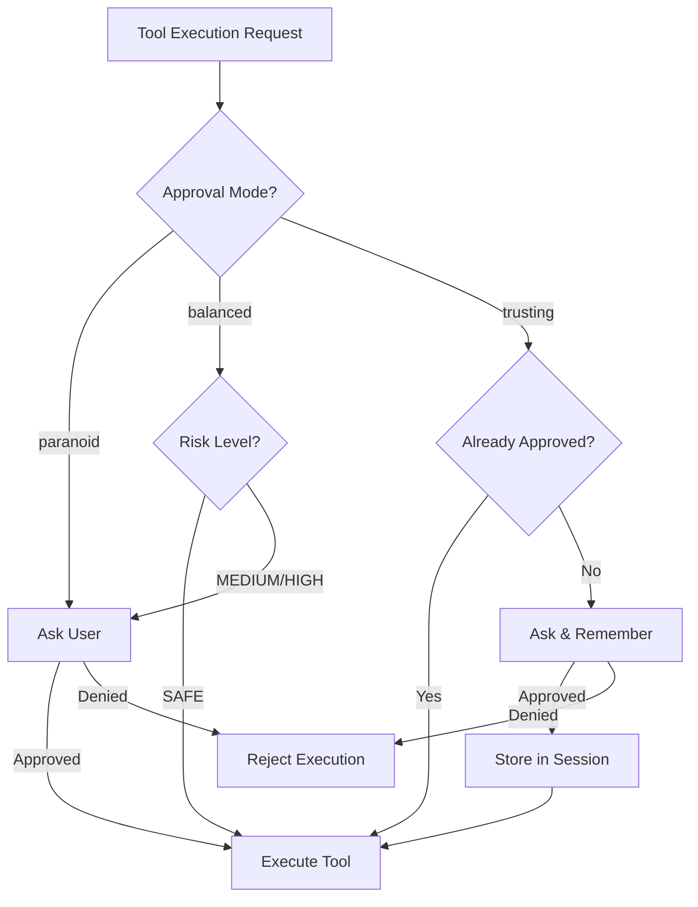

# Approval System

## Purpose

The Approval System controls when the user is asked for permission before a tool executes. It's the safety layer that protects Neo from unintended actions in the Matrix.

## Decisions

### Approval Modes

**Decided:** Keep three modes (same as CDD)

| Mode | Behavior | Use Case |
|------|----------|----------|
| `paranoid` | Ask before every tool execution | Learning, sensitive environments |
| `balanced` | Auto-approve SAFE, ask for MEDIUM/HIGH | Daily use (default) |
| `trusting` | Remember approvals in session | Experienced users, repetitive tasks |

### Default Mode

**Decided:** `balanced`

This provides a good balance between safety and usability for most users.

### Session Memory (Trusting Mode)

**Decided:** Keep this behavior

In `trusting` mode:
- First time a tool is used → ask for approval
- If approved → remember for rest of session
- Session ends → memory cleared
- Next session → ask again

## Open Questions (Team Discussion Required)

### Matrix Theming for Approval Prompts

Options to discuss:
- Thematic: "Do you want to take the red pill and run `git push`?"
- Professional: "Allow `git push origin main`? [y/N]"
- Hybrid: Subtle theming without sacrificing clarity

## Approval Logic



## Risk Level Mapping

| Risk Level | Paranoid | Balanced | Trusting |
|------------|----------|----------|----------|
| SAFE | Ask | Auto-approve | Remember |
| MEDIUM | Ask | Ask | Remember |
| HIGH | Ask | Ask | Remember |

## Interface

```python
class ApprovalManager:
    """Manages tool execution approvals."""

    def __init__(self, mode: ApprovalMode, ui_callback: Callable):
        self.mode = mode
        self.ui_callback = ui_callback
        self.session_approvals: set[str] = set()

    def request_approval(
        self,
        tool_name: str,
        tool_args: dict,
        risk_level: RiskLevel,
    ) -> bool:
        """Request approval for a tool execution.

        Returns True if approved, False if denied.
        """
        ...

    def clear_session(self) -> None:
        """Clear session memory (for trusting mode)."""
        self.session_approvals.clear()


class ApprovalMode(Enum):
    PARANOID = "paranoid"
    BALANCED = "balanced"
    TRUSTING = "trusting"
```

## Approval Prompt Structure

When asking the user:

```
┌─────────────────────────────────────────────┐
│  Tool: git_push                             │
│  Risk: HIGH                                 │
│                                             │
│  Arguments:                                 │
│    remote: origin                           │
│    branch: main                             │
│                                             │
│  Allow execution? [y/N]                     │
└─────────────────────────────────────────────┘
```

## Dependencies

- Tool System (provides risk levels)
- Configuration System (provides default mode)
- UI Layer (for prompts)

## Configuration

Set via:

1. CLI flag: `matrix --approval paranoid`
2. Environment: `MATRIX_APPROVAL_MODE=trusting`
3. Config file: `~/.matrix/settings.json`

```json
{
  "approval_mode": "balanced"
}
```
