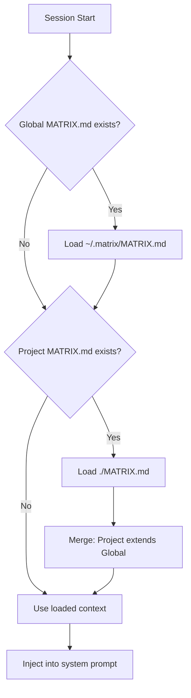

# Context Loading

## Purpose

Context Loading injects project-specific and global knowledge into every conversation. It's how agents "know" about your codebase, coding standards, and architecture before you even ask - like downloading skills directly into Neo's brain.

## Decisions

### Context File Name

**Decided:** `MATRIX.md`

### Global Context Location

**Decided:** `~/.matrix/MATRIX.md`

### Hierarchical Merge

**Decided:** Yes, keep hierarchical merge

```
~/.matrix/MATRIX.md    (global context)
        ↓
     merge
        ↓
./MATRIX.md            (project context - overrides/extends global)
        ↓
  inject into system prompt
```

### Caching

**Decided:** No caching

Context files are read fresh on each session start. This ensures:
- Changes are immediately reflected
- No stale context issues
- Simpler implementation

## Context File Locations

| Type | Location | Purpose |
|------|----------|---------|
| Global | `~/.matrix/MATRIX.md` | Personal defaults, coding style |
| Project | `./MATRIX.md` (project root) | Project-specific context |

## Project Root Detection

The system finds the project root by looking for (in order):

1. `.git/`
2. `pyproject.toml`
3. `package.json`
4. `Cargo.toml`
5. `go.mod`
6. `Makefile`

First match determines the project root.

## Merge Behavior

When both global and project context exist:



**Merge rules:**
- Project context is appended after global context
- Project context can override global instructions
- Both are visible to the agent as unified context

## Context File Format

`MATRIX.md` is a markdown file with free-form content:

```markdown
# Project Context

## Architecture
This is a Python CLI tool using Click framework...

## Coding Standards
- Use type hints everywhere
- Follow PEP 8
- Docstrings in Google format

## Important Files
- `src/matrix_cli/cli.py` - Main entry point
- `src/matrix_cli/agents/` - Agent implementations

## Notes
- Always run tests before committing
- Use conventional commits
```

## Interface

```python
class ContextLoader:
    """Loads and merges context from MATRIX.md files."""

    def __init__(self, project_path: Path | None = None):
        self.project_path = project_path or self._detect_project_root()

    def load(self) -> str:
        """Load and merge context from global and project files.

        Returns:
            Merged context string, or empty string if no context files found.
        """
        ...

    def _detect_project_root(self) -> Path | None:
        """Find project root by looking for marker files."""
        ...

    def _load_global(self) -> str | None:
        """Load ~/.matrix/MATRIX.md if it exists."""
        ...

    def _load_project(self) -> str | None:
        """Load ./MATRIX.md if it exists."""
        ...
```

## Usage in System Prompt

```python
context = ContextLoader().load()

system_prompt = f"""You are the Operator...

{f"## Project Context\n\n{context}" if context else ""}

## Instructions
...
"""
```

## Dependencies

- File system access
- Path utilities

## CLI Flag

Users can skip context loading:

```bash
matrix --no-context
```

This is useful for:
- Quick one-off questions
- Testing without project context
- When context file has issues
