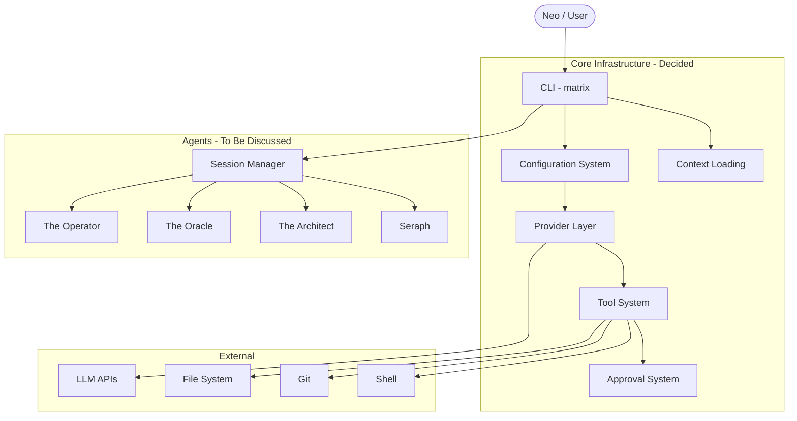

# Matrix CLI Architecture

## Overview

Matrix CLI is a rewrite of the [CDD Agent](https://github.com/...) with a Matrix (movie) theme. It's an AI-powered CLI tool for context-driven development.

### Character Mapping

| CDD Agent | Matrix CLI | Role |
|-----------|------------|------|
| User | **Neo** | The One who drives everything |
| General Agent | **The Operator** | Main chat, tool execution, support |
| Socrates | **The Oracle** | Requirements gathering through dialogue |
| Planner | **The Architect** | System design, plan generation |
| Executor | **Seraph** | Plan execution, code implementation |

## Architecture Documents

### Core Infrastructure (Decided)

| # | Component | Status | Document |
|---|-----------|--------|----------|
| 1 | [CLI & Entry Points](./01-cli-entry-points.md) | Decided | How users interact with the system |
| 2 | [Configuration System](./02-configuration-system.md) | Decided | Settings, credentials, preferences |
| 3 | [Provider Layer](./03-provider-layer.md) | Decided | LLM abstraction (Anthropic, OpenAI) |
| 4 | [Tool System](./04-tool-system.md) | Decided | Tools agents use to interact with the world |
| 5 | [Approval System](./05-approval-system.md) | Decided | Permission control for tool execution |
| 6 | [Context Loading](./06-context-loading.md) | Decided | Project and global context injection |

### To Be Discussed

| # | Component | Status | Document |
|---|-----------|--------|----------|
| 7 | Conversation Management | To discuss | [Brief description](./07-to-be-discussed.md#conversation-management) |
| 8 | The Operator | To discuss | [Brief description](./07-to-be-discussed.md#the-operator-general-agent) |
| 9 | The Oracle | To discuss | [Brief description](./07-to-be-discussed.md#the-oracle-socrates-agent) |
| 10 | The Architect | To discuss | [Brief description](./07-to-be-discussed.md#the-architect-planner-agent) |
| 11 | Seraph | To discuss | [Brief description](./07-to-be-discussed.md#seraph-executor-agent) |
| 12 | Session & Slash Commands | To discuss | [Brief description](./07-to-be-discussed.md#session--slash-commands) |

## System Diagram

## Key Decisions Summary

| Decision | Choice |
|----------|--------|
| CLI command | `matrix` |
| Config location | `~/.matrix/` |
| Env var prefix | `MATRIX_*` |
| Model tiers | `small/mid/big` |
| Providers | Anthropic + OpenAI |
| Streaming | Always stream |
| Context file | `MATRIX.md` |
| Context caching | No |
| Approval default | `balanced` |
| Git tools | Full suite |

## Open Questions for Team

1. **CLI UX** - Interactive mode flags, startup experience
2. **Matrix Theme** - Level of thematic styling vs professional tooling
3. **Agent Personas** - How thematic should agent personalities be?
4. **Slash Commands** - `/oracle`, `/architect`, `/seraph` vs other names?
5. **File Structure** - Where to store specs, plans, execution state?
